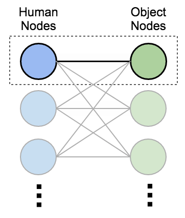
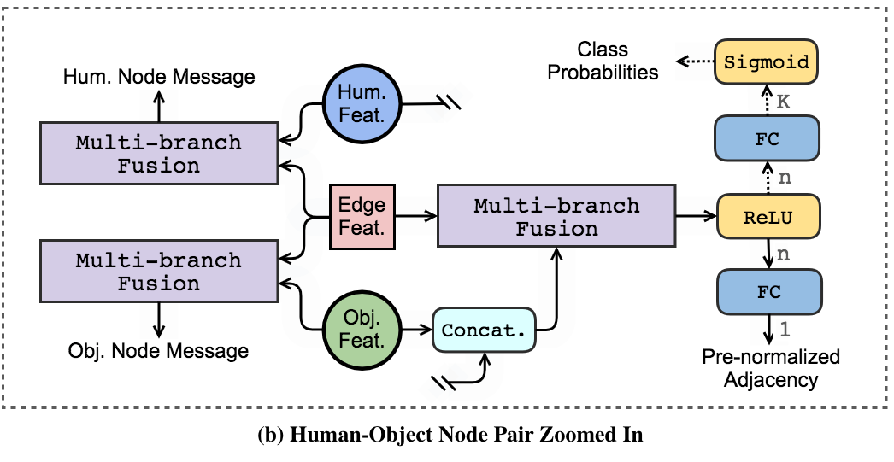
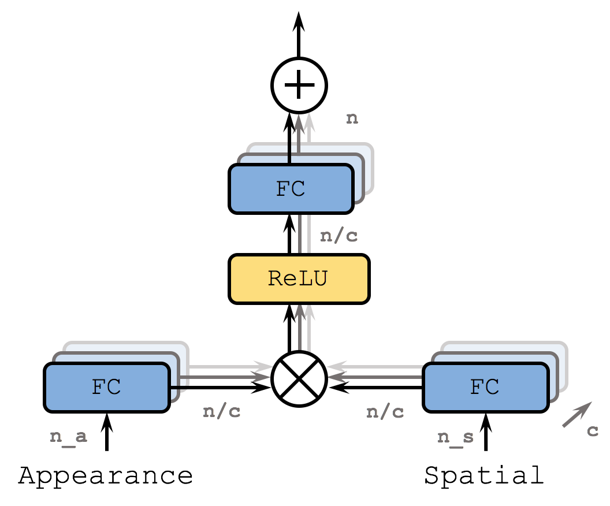

# Spatio-attentive Graphs

Official PyTorch implementation for our paper [Spatio-attentive Graphs for Human-Object Interaction Detection](https://arxiv.org/pdf/2012.06060.pdf)





## Citation

If you find this repository useful for your research, please kindly cite our paper:

```bibtex
@article{zhang2020,
	author = {Frederic Z. Zhang and Dylan Campbell and Stephen Gould},
	title = {Spatio-attentive Graphs for Human-Object Interaction Detection},
	journal = {arXiv preprint arXiv:2012.06060},
	year = {2020}
}
```

## Prerequisites

1. Download the repository with `git clone https://github.com/fredzzhang/spatio-attentive-graphs`
2. Install the lightweight deep learning library [Pocket](https://github.com/fredzzhang/pocket)
3. Make sure the environment you created for Pocket is activated. You are good to go!

## Data Utilities

The [HICO-DET repository](https://github.com/fredzzhang/hicodet) has been incorporated as a submodule for convenience.
1. Download data utilities
```bash
cd /path/to/spatio-attentive-graphs
git submodule init
git submodule update
```
2. Prepare the [HICO-DET dataset](https://drive.google.com/open?id=1QZcJmGVlF9f4h-XLWe9Gkmnmj2z1gSnk)
    1. If you have not downloaded the dataset before, run the following script
    ```bash
    cd hicodet
    bash download.sh
    ```
    2. If you have previously downloaded the dataset, simply create a soft link
    ```bash
    cd hicodet
    ln -s /path/to/hico_20160224_det ./hico_20160224_det
    ```
3. Run a Faster R-CNN pre-trained on MS COCO to generate detections
```bash
cd detections
python preprocessing.py --partition train2015
python preprocessing.py --partition test2015
```
4. Generate ground truth detections (optional)
```bash
python generate_gt_detections.py --partition test2015 
```
5. Download fine-tuned detections (optional)
```bash
cd ../../download
bash download_finetuned_detections.sh
```
To attempt fine-tuning yourself, refer to the [instructions](https://github.com/fredzzhang/hicodet/tree/main/detections#fine-tune-the-detector-on-hico-det) in the [HICO-DET repository](https://github.com/fredzzhang/hicodet). The checkpoint of our fine-tuned detector can be found [here](https://drive.google.com/file/d/11lS2BQ_In-22Q-SRTRjRQaSLg9nSim9h/view?usp=sharing).

## Testing

1. Download the checkpoint of our trained model
```bash
cd /path/to/spatio-attentive-graphs/download
bash download_checkpoint.sh
```
2. Test a model
```bash
cd /path/to/spatio-attentive-graphs
CUDA_VISIBLE_DEVICES=0 python test.py --model-path checkpoints/spatio-attentive-graph-hicodet-e11.pt
```
By default, detections from a pre-trained detector is used. To change sources of detections, use the argument `--detection-dir`, e.g. `--detection-dir hicodet/detections/test2015_gt` to select ground truth detections. Fine-tuned detections (if you downloaded them) are available under `hicodet/detections`.

3. Cache detections for Matlab evaluation following [HO-RCNN](https://github.com/ywchao/ho-rcnn) (optional)
```bash
cd /path/to/spatio-attentive-graphs
CUDA_VISIBLE_DEVICES=0 python cache.py --model-path checkpoints/spatio-attentive-graph-hicodet-e11.pt
```
By default, 80 `.mat` files, one for each object class, will be cached in a directory named `matlab`. Use the `--cache-dir` argument to change the cache directory. To change sources of detections, refer to the use of `--detection-dir` in the previous section.

As a reference, the performance of the provided model is shown in the table below

|Detector|mAP (Full, Rare, Non-rare)|
|:-|:-:|
|Pre-trained on MS COCO|(`18.24`, `12.91`, `19.83`)|
|Fine-tuned on HICO-DET ([VCL](https://github.com/zhihou7/VCL))|(`22.04`, `15.73`, `23.93`)|
|Fine-tuned on HICO-DET ([This repo](https://github.com/fredzzhang/hicodet))|(`22.56`, `15.52`, `24.67`)|
|Fine-tuned on HICO-DET ([DRG](https://github.com/vt-vl-lab/DRG))|(`28.54`, `21.10`, `30.77`)|
|Ground truth detections|(`47.88`, `34.03`, `52.01`)|

## Training

1. Training with a single GPU (recommended)
```bash
CUDA_VISIBLE_DEVICES=0 python main.py &>log &
```
Note that setting the environmental variable `CUDA_VISIBLE_DEVICES` is necessary and should __NOT__ be omitted, due to the design of the used learning engine. It is recommended to redirect `stdout` and `stderr` to a file to save the training log (as indicated by `&>log`). To check the progress, run `cat log | grep mAP`, or alternatively you can go through the log with `vim log`. The training process takes about 48 hrs on a single GeForce GTX TITAN X device. Therefore it is recommended to run the script asynchronously (as indicated by `&`). By default, checkpoints will be saved under `checkpoints` in the current directory. For more arguments, run `python main.py --help` to find out.

2. Training with `DistributedDataParallel` (not fully tested)
```bash
CUDA_VISIBLE_DEVICES=0,1,2,3 python main_dist.py --word-size 4 --learning-rate 0.004 &>log &
```
Specify the number of GPUs with the argument `--word-size`, which should be no larger than the number of GPUs specified by `CUDA_VISIBLE_DEVICES`. The default learning rate for a single GPU is `0.001`. As a rule of thumb, multiply that by the number of GPUs during training. For more arguments, run `python main_dist.py --help` to find out.

## Contact

If you have any questions or doubts, feel free to open an issue. Alternatively, you can contact me at frederic.zhang@anu.edu.au