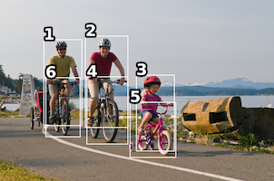
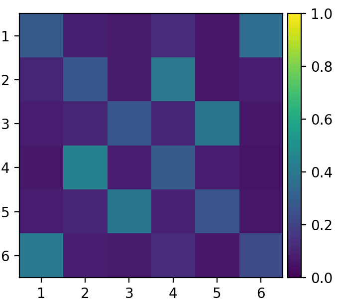
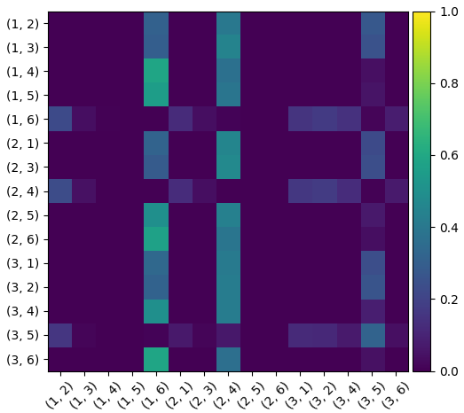
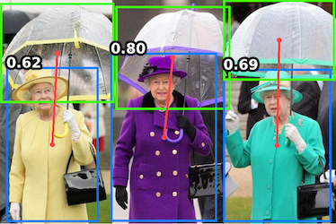

# UPT: Unary&ndash;Pairwise Transformers


[](https://paperswithcode.com/sota/human-object-interaction-detection-on-hico?p=efficient-two-stage-detection-of-human-object) [](https://paperswithcode.com/sota/human-object-interaction-detection-on-v-coco?p=efficient-two-stage-detection-of-human-object)

[](https://www.python.org/) [](https://pytorch.org/get-started/locally/) [](https://github.com/fredzzhang/pocket) [](./LICENSE)

This repository contains the official PyTorch implementation for the paper
> Frederic Z. Zhang, Dylan Campbell and Stephen Gould. _Efficient Two-Stage Detection of Human&ndash;Object Interactions with a Novel Unary&ndash;Pairwise Transformer._ arXiv preprint arXiv:2112.01838.

\[[__project page__](https://fredzzhang.com/unary-pairwise-transformers)\] \[[__preprint__](https://arxiv.org/pdf/2112.01838.pdf)\]

## Abstract
> ...<br/>However, the success of such one-stage HOI detectors can largely be attributed to the representation power of transformers. We discovered that when equipped with the same transformer, their two-stage counterparts can be more performant and memory-efficient, while taking a fraction of the time to train. In this work, we propose the Unary&ndash;Pairwise Transformer, a two-stage detector that exploits unary and pairwise representa-tions for HOIs. We observe that the unary and pairwise parts of our transformer network specialise, with the former preferentially increasing the scores of positive examples and the latter decreasing the scores of negative examples. We evaluate our method on the HICO-DET and V-COCO datasets, and significantly outperform state-of-the-art approaches. At inference time, our model with ResNet50 approaches real-time performance on a single GPU.

## Demonstration on data in the wild


## Model Zoo
We provide weights for UPT models pre-trained on HICO-DET and V-COCO for potential downstream applications. In addition, we also provide weights for fine-tuned DETR models to facilitate reproducibility. To attempt fine-tuning the DETR model yourself, refer to [this repository](https://github.com/fredzzhang/hicodet).

|Model|Dataset|Default Settings|Inference|UPT Weights|DETR Weights|
|:-|:-:|:-:|:-:|:-:|:-:|
|UPT-R50|HICO-DET|(`31.66`, `25.94`, `33.36`)|`0.042s`|[weights](https://drive.google.com/file/d/1lvopTC_JlGHdKOyyEZTUp2VtFfCQ-08z/view?usp=sharing)|[weights](https://drive.google.com/file/d/1BQ-0tbSH7UC6QMIMMgdbNpRw2NcO8yAD/view?usp=sharing)|
|UPT-R101|HICO-DET|(`32.31`, `28.55`, `33.44`)|`0.061s`|[weights](https://drive.google.com/file/d/10-ht8AO4AvqtX2AJ0hXq1Fz0-W8qST-E/view?usp=sharing)|[weights](https://drive.google.com/file/d/1pZrRp8Qcs5FNM9CJsWzVxwzU7J8C-t8f/view?usp=sharing)|
|UPT-R101-DC5|HICO-DET|(`32.62`, `28.62`, `33.81`)|`0.124s`|[weights](https://drive.google.com/file/d/1MIPVz8VQf0D7iJFV5EMJN9IZc9j3Mlo1/view?usp=sharing)|[weights](https://drive.google.com/file/d/1kkyVeoUGb8rT9b5J5Q3f51OFmm4Z73UD/view?usp=sharing)|

|Model|Dataset|Scenario 1|Scenario 2|Inference|UPT Weights|DETR Weights|
|:-|:-:|:-:|:-:|:-:|:-:|:-:|
|UPT-R50|V-COCO|`59.0`|`64.5`|`0.043s`|[weights](https://drive.google.com/file/d/17Cfse3pNarVgFZd0ArMg-h6yWEYpa2NQ/view?usp=sharing)|[weights](https://drive.google.com/file/d/1AIqc2LBkucBAAb_ebK9RjyNS5WmnA4HV/view?usp=sharing)|
|UPT-R101|V-COCO|`60.7`|`66.2`|`0.064s`|[weights](https://drive.google.com/file/d/1ahE9K-XocMfu1wm8-rEBx4py8m3-_tmt/view?usp=sharing)|[weights](https://drive.google.com/file/d/1XbOaGiVPuxmB9PwrcUdf0XlGnuTXARjX/view?usp=sharing)|
|UPT-R101-DC5|V-COCO|`61.3`|`67.1`|`0.131s`|[weights](https://drive.google.com/file/d/17ivP1npCR6jkxOQ3mfN83hrQfeVkiDC9/view?usp=sharing)|[weights](https://drive.google.com/file/d/1uenwkJ_0dSb_nb4HAlMUZ-bMjxD55XTR/view?usp=sharing)|

 The inference speed was benchmarked on a GeForce RTX 3090. Note that weights of the UPT model include those of the detector (DETR). You do not need to download the DETR weights, unless you want to train the UPT model from scratch. Training UPT-R50 with 8 GeForce GTX TITAN X GPUs takes around `5` hours on HICO-DET and `40` minutes on V-COCO, almost a tenth of the time compared to other one-stage models such as [QPIC](https://github.com/hitachi-rd-cv/qpic).
## Contact
For general inquiries regarding the paper and code, please post them in [Discussions](https://github.com/fredzzhang/upt/discussions). For bug reports and feature requests, please post them in [Issues](https://github.com/fredzzhang/upt/issues). You can also contact me at frederic.zhang@anu.edu.au.
## Prerequisites
1. Install the lightweight deep learning library [Pocket](https://github.com/fredzzhang/pocket). The recommended PyTorch version is 1.9.0.
Make sure the environment for Pocket is activated (`conda activate pocket`), and install the packaging library with `pip install packaging`. 
2. Download the repository and the submodules.
```bash
git clone https://github.com/fredzzhang/upt.git
cd upt
git submodule init
git submodule update
```
3. Prepare the [HICO-DET dataset](https://drive.google.com/open?id=1QZcJmGVlF9f4h-XLWe9Gkmnmj2z1gSnk).
    1. If you have not downloaded the dataset before, run the following script.
    ```bash
    cd /path/to/upt/hicodet
    bash download.sh
    ```
    2. If you have previously downloaded the dataset, simply create a soft link.
    ```bash
    cd /path/to/upt/hicodet
    ln -s /path/to/hicodet_20160224_det ./hico_20160224_det
    ```
4. Prepare the V-COCO dataset (contained in [MS COCO](https://cocodataset.org/#download)).
    1. If you have not downloaded the dataset before, run the following script
    ```bash
    cd /path/to/upt/vcoco
    bash download.sh
    ```
    2. If you have previously downloaded the dataset, simply create a soft link
    ```bash
    cd /path/to/upt/vcoco
    ln -s /path/to/coco ./mscoco2014
    ```
## License
UPT is released under the [BSD-3-Clause License](./LICENSE).
## Inference
We have implemented inference utilities with different visualisation options. Provided you have downloaded the model weights to `checkpoints/`, run the following command to visualise detected instances together with the attention maps from the cooperative and competitive layers. Use the flag `--index` to select images, and `--box-score-thresh` to modify the filtering threshold on object boxes.
```bash
python inference.py --resume checkpoints/upt-r50-hicodet.pt --index 8789
```
Here is the sample output. Note that we manually selected some informative attention maps to display. The predicted scores for each action will be printed by the script as well.





To select the V-COCO dataset and V-COCO models, use the flag `--dataset vcoco`, and then load the corresponding weights. To visualise interactive human-object pairs for a particular action class, use the flag `--action` to specify the action index. Here is a [lookup table](./assets/actions.txt) for the action indices.

Additionally, to cater for different needs, we implemented an option to run inference on custom images, using the flag `--image-path`. The following is an example for interaction _holding an umbrella_.
```bash
python inference.py --resume checkpoints/upt-r50-hicodet.pt --image-path ./assets/umbrella.jpeg --action 36
```


## Training and Testing

Refer to [`launch_template.sh`](./launch_template.sh) for training and testing commands with different options. To train the UPT model from scratch, you need to download the weights for the corresponding DETR model, and place them under `/path/to/upt/checkpoints/`. Adjust `--world-size` based on the number of GPUs available.

To test the UPT model on HICO-DET, you can either use the Python utilities we implemented or the Matlab utilities provided by [Chao et al.](https://github.com/ywchao/ho-rcnn). For V-COCO, we did not implement evaluation utilities, and instead use the utilities provided by [Gupta et al.](https://github.com/s-gupta/v-coco#evaluation). Refer to these [instructions](https://github.com/fredzzhang/upt/discussions/14) for more details.

## Citation

If you find our work useful for your research, please consider citing us:

```bibtex
@article{zhang2021upt,
  author    = {Frederic Z. Zhang and Dylan Campbell and Stephen Gould},
  title     = {Efficient Two-Stage Detection of Human-Object Interactions with a Novel Unary-Pairwise Transformer},
  journal   = {arXiv preprint arXiv:2112.01838},
  year      = {2021}
}

@inproceedings{zhang2021scg,
  author    = {Frederic Z. Zhang, Dylan Campbell and Stephen Gould},
  title     = {Spatially Conditioned Graphs for Detecting Human–Object Interactions},
  booktitle = {Proceedings of the IEEE/CVF International Conference on Computer Vision (ICCV)},
  month     = {October},
  year      = {2021},
  pages     = {13319-13327}
}
```
